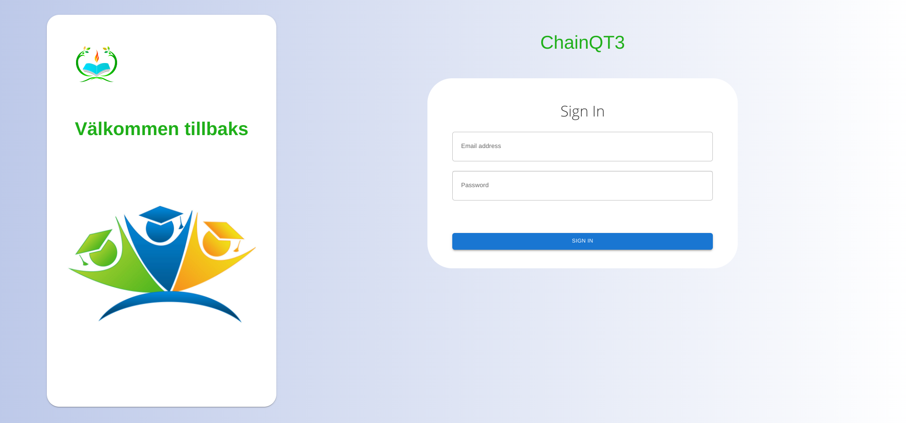

# Keycloak style with keycloakify library
> [https://docs.keycloakify.dev/](https://docs.keycloakify.dev/).

> [https://github.com/InseeFrLab/keycloakify](https://github.com/InseeFrLab/keycloakify).

> [https://github.com/garronej/keycloakify-advanced-starter](https://github.com/garronej/keycloakify-advanced-starter).

## Screens


### Uncomment mockPageId in kcContext.ts to style page
```
// "mockPageId": "login.ftl",
```

### Setup and build keycloak
```
yarn

# yarn keycloak needs to be run atleast once
# // "mockPageId": "login.ftl", needs to be comment before build
yarn keycloak

./build_keycloak/start_keycloak_testing_container.sh
```

### Build docker image and create/start
```
./build_keycloak/<project-name>.sh
```

### http://0.0.0.0:8080
``` 
docker run \
   -p 8080:8080 \
   --name keycloak-testing-container \
   -e KEYCLOAK_ADMIN=admin \
   -e KEYCLOAK_ADMIN_PASSWORD=admin \
   -e JAVA_OPTS=-Dkeycloak.profile=preview \
   -v <project-root>/build_keycloak/src/main/resources/theme/<project-name>:/opt/keycloak/themes/<project-name>:rw \
   -it quay.io/keycloak/keycloak:18.0.2 \
   start-dev
```